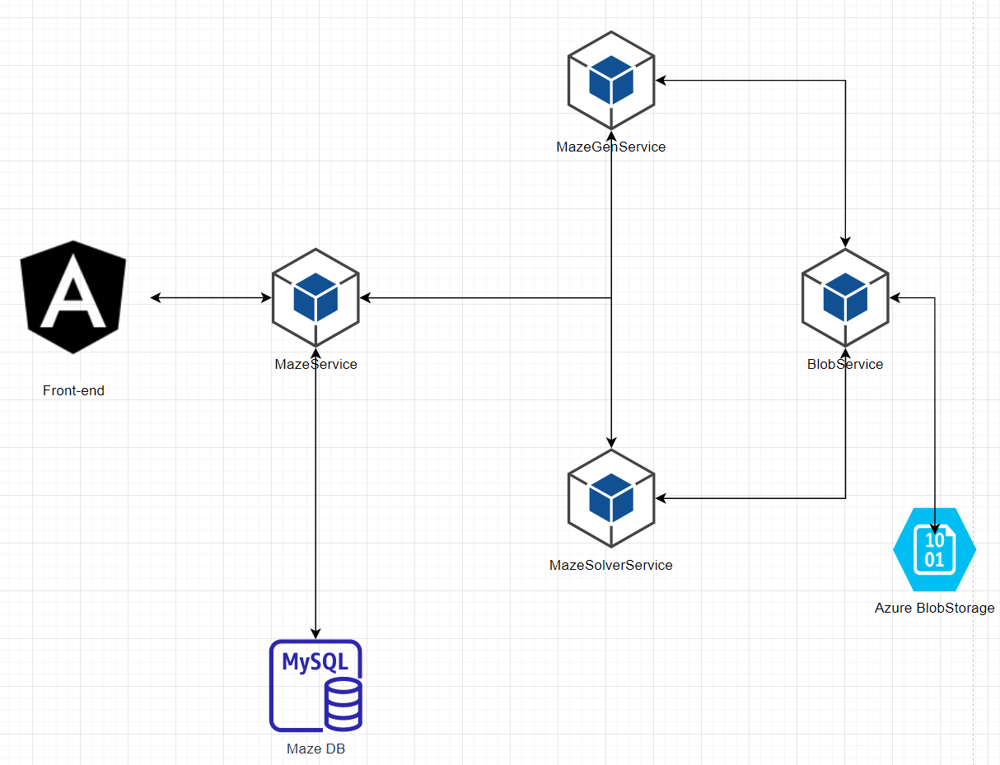

### Image Downloader:
Application to generate and solve mazes.

#### How to run:
open cmd and run command: 
` powershell -command "& .\run-app.ps1" 
`

after building is done, head to 'http://localhost:4200' 

#### How to use:
Firstly generate maze using *Generate maze* button. After creating, set start and end position. Maze solver will find path between those two points. After setting positons, use *Solve maze* button to solve the maze. Path will be shown on the screen. 

#### Used Algorithms
Mazes are generated using backtracking algorithm. Application supports solving mazes with BFS algorithm.
Application is open to further development.

#### Architecture:
Application is based on microservice architecture. Mazes are stored as blob files in Azure BlobStorage. Application consists of microservices:

 1. MazeService - main service which delegates work to other services
 2. MazeGenService - is responsible for generating mazes
 3. MazeSolverService - solves maze with given algorithm
 5. BlobService - is responsible for exchanging data with Azure BlobStorage and other services

#### Details:
Architecture diagram:

MySql database stores only base information about maze like: it's name or description. Actual maze is stored in a blob file as json file. Example file of 3x3 maze:
``` 
   [
      {
        "walls": 1011
      },
      {
        "walls": 1010
      },
      {
        "walls": 1100
      }
    ],
    [
      {
        "walls": 1101
      },
      {
        "walls": 1001
      },
      {
        "walls": 110
      }
    ],
    [
      {
        "walls": 11
      },
      {
        "walls": 10
      },
      {
        "walls": 1110
      }
    ]
  ]
  ```

each value is cell with walls: up, right, down and left saved as integer. This helps to compress the size of the file and http requests.

#### Author:
Krzysztof Pieczyński

